# 📊 AmbitionBox Company Analysis

> **An End-to-End Data Analytics Project that demonstrates the complete analytics lifecycle from Web Scraping to Business Intelligence using Python and Power BI.**

<p align="center">


</p>

---

# 📌 Project Overview

This project showcases an **end-to-end Data Analytics workflow** by collecting real-world company information from **AmbitionBox**, transforming the raw data into a clean analytical dataset, performing comprehensive **Exploratory Data Analysis (EDA)** using Python, and finally developing an **interactive Power BI dashboard** for business intelligence.

Unlike projects that begin with a ready-made dataset, this project starts from **data collection**, making it representative of a real analytics workflow.

The analysis focuses on understanding:

- Company ratings
- Salary trends
- Job openings
- Interview experiences
- Employee benefits
- Company types
- Hiring locations
- Relationships between different business metrics

---

# 🎯 Project Objectives

- Collect company information through web scraping
- Clean and preprocess raw data
- Perform Exploratory Data Analysis (EDA)
- Discover meaningful business insights
- Build an interactive Power BI dashboard
- Present findings through effective data visualization

---

# 🔄 End-to-End Workflow

```text
               AmbitionBox Website
                       │
                       ▼
              Web Scraping (Python)
                       │
                       ▼
          Data Cleaning & Preprocessing
                 (Pandas & NumPy)
                       │
                       ▼
        Exploratory Data Analysis (EDA)
     (Matplotlib & Seaborn Visualizations)
                       │
                       ▼
      Interactive Power BI Dashboard
                       │
                       ▼
           Business Insights & Reporting
```

---

# 🛠️ Technology Stack

| Category | Technologies |
|-----------|--------------|
| Programming Language | Python |
| Web Scraping | Requests, BeautifulSoup |
| Data Processing | Pandas, NumPy |
| Visualization | Matplotlib, Seaborn |
| Dashboard | Power BI |
| Development Environment | Jupyter Notebook |
| Version Control | Git & GitHub |

---

# 📂 Repository Structure

```text
AmbitionBox-Company-Analysis
│
├── Dashboard
│   ├── AmbitionBox_Company_Analysis.pbix
│   └── AmbitionBox_Company_Analysis_Dashboard.pdf
│
├── data
│   ├── AmbitionBox_Companies_Raw.csv
│   └── AmbitionBox_Companies_Cleaned.csv
│
├── notebooks
│   ├── 01_Web_Scraping_and_Data_Cleaning.ipynb
│   └── 02_Exploratory_Data_Analysis.ipynb
│
├── images
│   ├── WebScraping
│   ├── DataCleaning
│   ├── EDA
│   └── PowerBI
│
├── README.md
├── requirements.txt
├── LICENSE
└── .gitignore
```

---

# ⭐ Project Highlights

- ✅ Real-world data collected through Web Scraping
- ✅ Data Cleaning and Preprocessing
- ✅ Exploratory Data Analysis (EDA)
- ✅ Statistical Analysis
- ✅ Business Insight Generation
- ✅ Interactive Power BI Dashboard
- ✅ Well-structured GitHub Repository
- ✅ End-to-End Data Analytics Workflow

---

# 🌐 Web Scraping

The first stage of the project involved collecting real-world company data from the **AmbitionBox** website using Python. Instead of relying on a pre-built dataset, the data was gathered programmatically to simulate a real-world analytics workflow.

### Data Collected

- Company Name
- Company Rating
- Salary Information
- Number of Job Openings
- Interview Count
- Employee Benefits
- Company Type
- Headquarters

### Tools Used

- Requests
- BeautifulSoup
- Pandas

### Process

1. Sent HTTP requests to retrieve webpage content.
2. Parsed HTML using BeautifulSoup.
3. Extracted relevant company information.
4. Converted the extracted data into a structured Pandas DataFrame.
5. Exported the raw dataset as a CSV file for further processing.

### Screenshots

#### Web Scraping Workflow

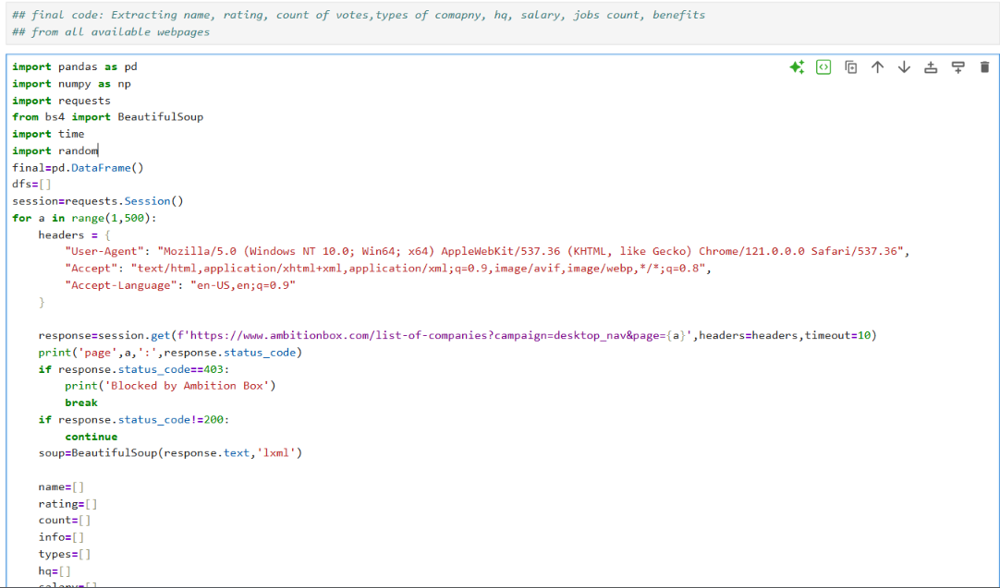

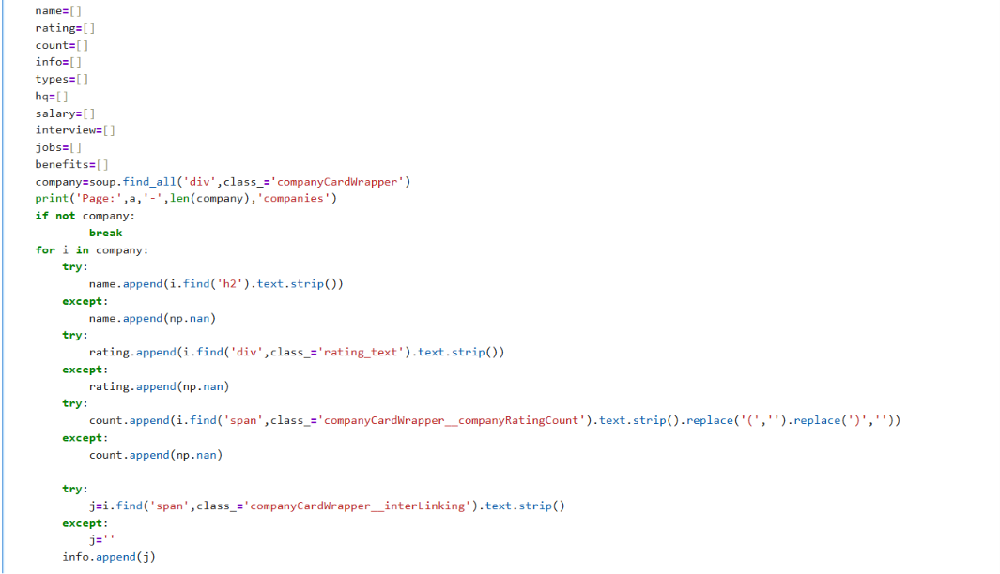

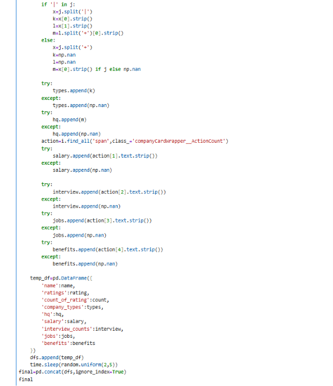

#### Scraped Dataset Preview


---

# 🧹 Data Cleaning & Preprocessing

Raw web-scraped data often contains inconsistencies, missing values, and formatting issues. Before analysis, the dataset was cleaned to improve its quality and usability.

### Data Cleaning Tasks

- Removed duplicate records
- Handled missing values
- Standardized column formats
- Converted numerical columns to appropriate data types
- Removed unwanted symbols and text
- Prepared the dataset for analysis

### Tools Used

- Pandas
- NumPy

### Screenshots

#### Data Cleaning Process


---

# 📊 Exploratory Data Analysis (EDA)

After cleaning the dataset, extensive exploratory analysis was performed to understand company hiring trends, salaries, ratings, interview experiences, and employee benefits.

The analysis included both univariate and multivariate visualizations to uncover meaningful business insights.

### Key Analyses Performed

- Dataset Overview
- Rating Distribution
- Salary Distribution
- Interview Analysis
- Company Popularity
- Benefits Analysis
- Correlation Analysis
- Outlier Detection

---

## ⭐ Rating Analysis

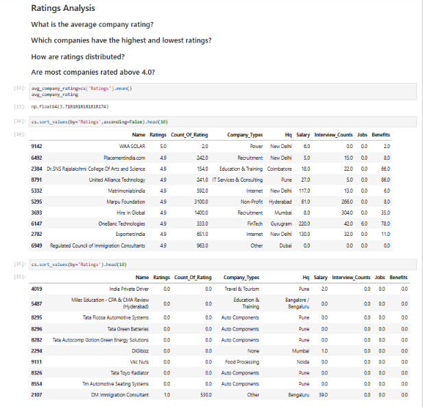

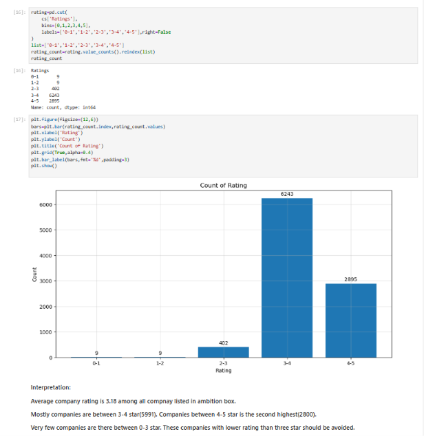

---

## 💰 Salary Analysis

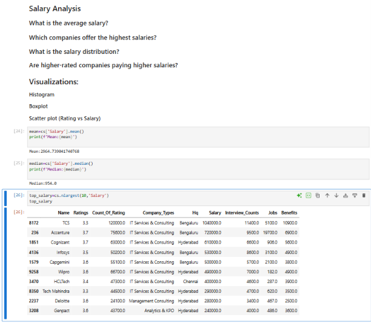

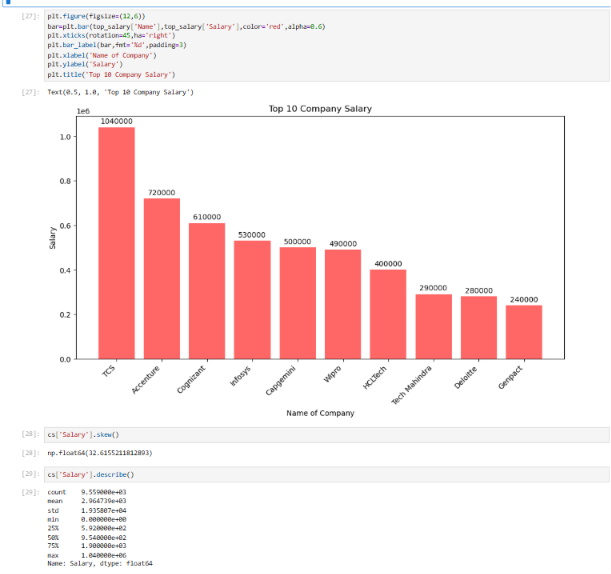

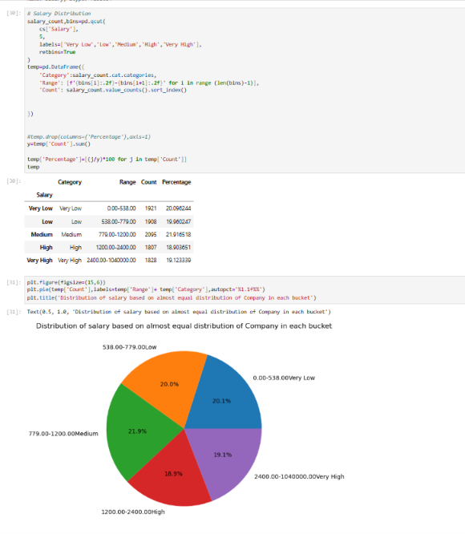

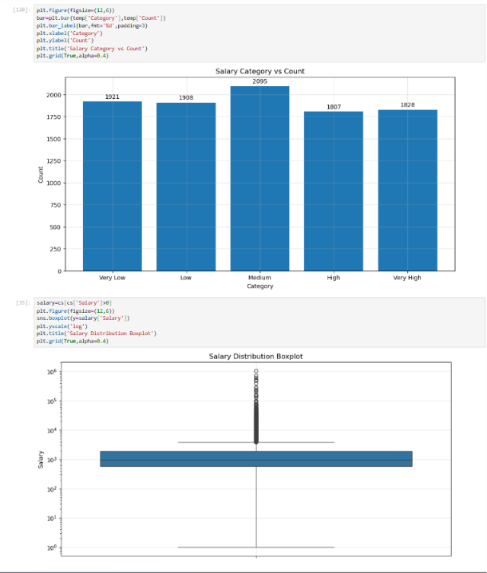

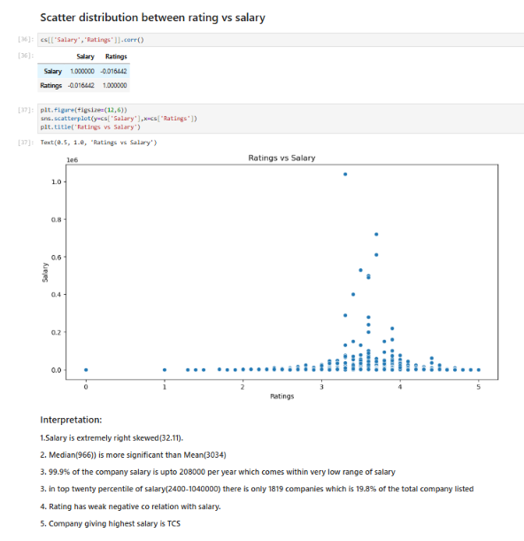

---

## 🎯 Interview Analysis

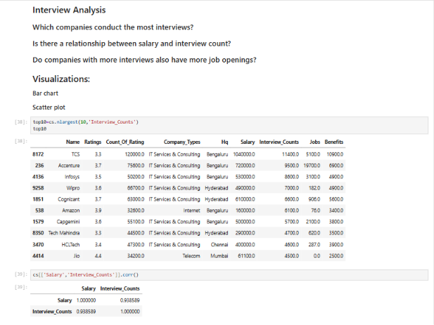

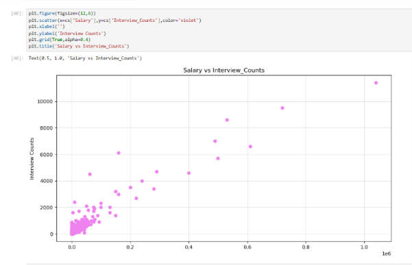

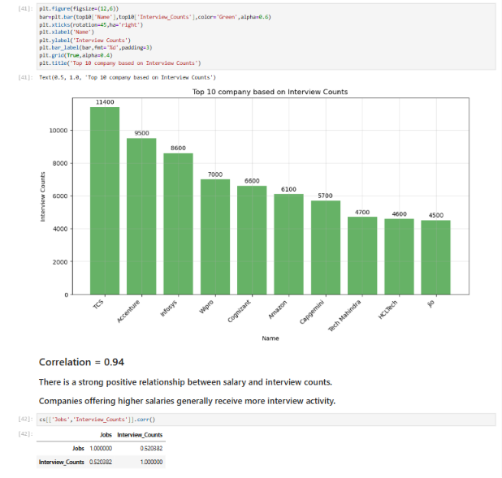

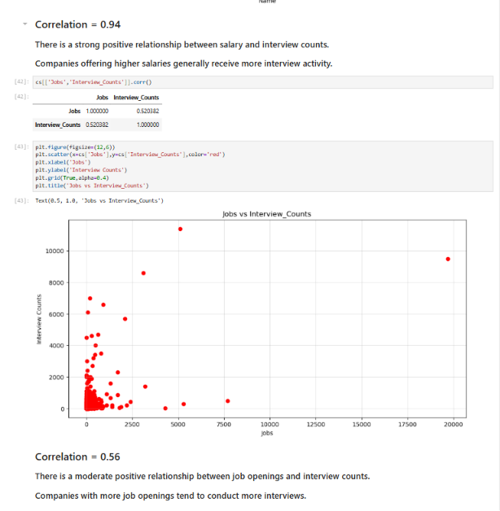

---

## 🔗 Correlation Analysis

The correlation matrix was used to understand relationships between different numerical variables and identify patterns within the dataset.

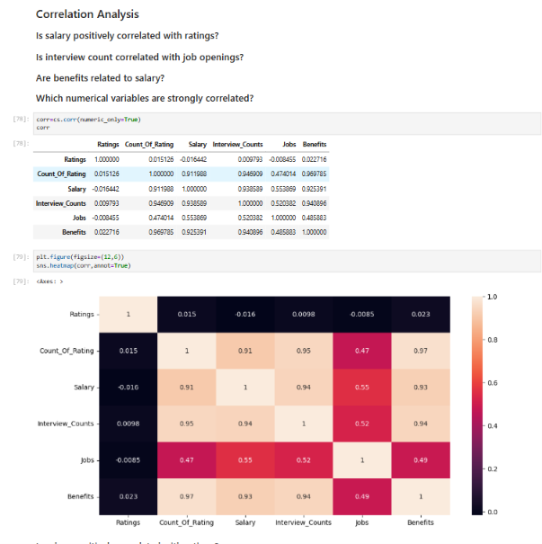

---

# 📈 Interactive Power BI Dashboard

To transform the analytical findings into an interactive business intelligence solution, a Power BI dashboard was developed using the cleaned dataset.

The dashboard enables users to explore company metrics dynamically through filters, KPIs, and interactive visualizations.

## Dashboard Features

- KPI Cards
  - Total Companies
  - Total Jobs
  - Average Rating
  - Average Salary
  - Total Interviews

- Interactive Slicers
  - Company Type
  - Rating Category
  - Salary Category
  - Headquarters

- Company Search

- Interactive Maps

- Conditional Formatting

- Dynamic Cross-filtering

- Business Insights Panel

---

## Dashboard Preview

### Main Dashboard


---

### Interactive Company Analysis Table


---

## Dashboard Files

The repository includes both:

- **Power BI Report (.pbix)** for further exploration
- **Dashboard PDF** for quick viewing without Power BI Desktop

Location:

```text
Dashboard/
├── AmbitionBox_Company_Analysis.pbix
└── AmbitionBox_Company_Analysis_Dashboard.pdf
```

---

# 💡 Key Business Insights

The exploratory analysis and dashboard revealed several meaningful patterns across the dataset:

### ⭐ Company Ratings
- Most companies have employee ratings between **3.5 and 4.5**, indicating generally positive workplace satisfaction.
- Only a small percentage of companies achieved ratings above **4.5**.

### 💰 Salary Trends
- Salary distribution is positively skewed, with a few companies offering significantly higher compensation.
- Higher-paying companies often attract more applicants and interview activity.

### 💼 Hiring Activity
- A small number of companies account for a large share of the available job openings.
- Large organizations dominate hiring within the dataset.

### 🎯 Interview Experience
- Companies with more employee reviews generally report higher interview activity.
- Popular employers tend to have more transparent recruitment processes.

### 🏢 Company Types
- IT Services & Consulting companies represent the largest share of the dataset.
- Other sectors contribute a comparatively smaller proportion.

### 📍 Headquarters Distribution
- Major metropolitan cities emerge as key hiring hubs, reflecting the concentration of corporate offices.

---

# 🚀 Getting Started

## Clone the Repository

```bash
git clone https://github.com/soumyadipsg-bit/AmbitionBox-Company-Analysis.git
```

---

## Navigate to the Project Folder

```bash
cd AmbitionBox-Company-Analysis
```

---

## Install Required Libraries

```bash
pip install -r requirements.txt
```

---

## Run the Notebooks

Execute the notebooks in the following order:

1. `01_Web_Scraping_and_Data_Cleaning.ipynb`
2. `02_Exploratory_Data_Analysis.ipynb`

---

# 📁 Dataset

The repository includes both the raw and cleaned datasets.

| Dataset | Description |
|----------|-------------|
| `AmbitionBox_Companies_Raw.csv` | Raw data collected using web scraping |
| `AmbitionBox_Companies_Cleaned.csv` | Cleaned dataset used for analysis and dashboard development |

---

# 📦 Project Deliverables

This repository contains:

- ✅ Python Web Scraping Notebook
- ✅ Data Cleaning Notebook
- ✅ Exploratory Data Analysis Notebook
- ✅ Raw Dataset
- ✅ Cleaned Dataset
- ✅ Power BI Dashboard (.pbix)
- ✅ Dashboard PDF
- ✅ Project Documentation
- ✅ GitHub Repository

---

# 📚 Future Enhancements

Potential extensions for this project include:

- Automating data collection with scheduled scraping
- Publishing the dashboard using Power BI Service
- Performing sentiment analysis on company reviews
- Building predictive models for company ratings or salaries
- Creating a live dashboard connected to refreshed data

---

# 👨‍💻 Author

**Soumyadip Gupta**

Aspiring Data Analyst with a background in Engineering, passionate about transforming raw data into meaningful insights through Python, SQL, Power BI, and data visualization.

### Connect with Me

- **LinkedIn:** https://www.linkedin.com/in/soumyadip-gupta-994866216
- **GitHub:** https://github.com/soumyadipsg-bit

---

# 📄 License

This project is licensed under the **MIT License**.

See the `LICENSE` file for more information.

---

# ⭐ Support

If you found this project useful:

- ⭐ Star this repository
- 🍴 Fork it
- 💬 Share your feedback
- 🤝 Connect with me on LinkedIn

Your feedback and suggestions are always appreciated!

---

<p align="center">

### Thanks for visiting this repository! 🚀

If you enjoyed exploring this project, consider giving it a ⭐ on GitHub.

</p>
