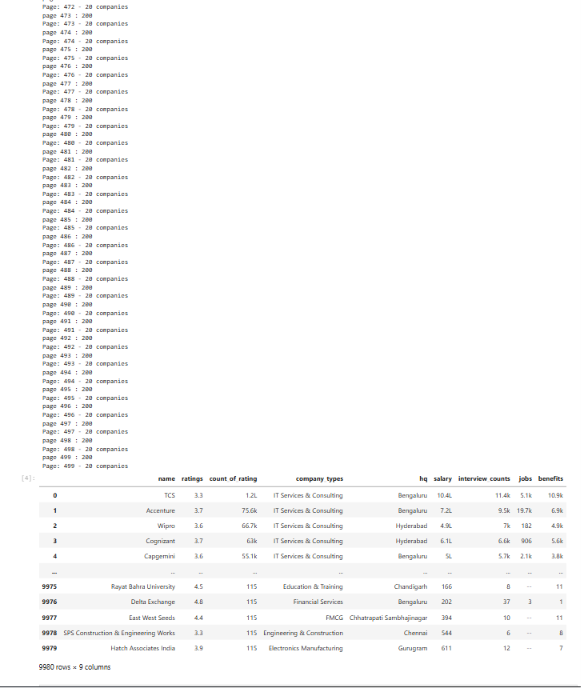

# 📊 AmbitionBox Company Analysis

> **An End-to-End Data Analytics Project using Web Scraping, Data Cleaning, and Exploratory Data Analysis (EDA)**


---

# 📌 Project Overview

This project demonstrates a complete **Data Analytics workflow**, beginning with collecting company information through **web scraping**, followed by **data cleaning**, and finally performing **Exploratory Data Analysis (EDA)** to uncover meaningful business insights.

The project analyses company ratings, salary trends, interview experiences, job openings, employee benefits, and company distribution using Python.

---

# 🎯 Objectives

- Scrape company information from AmbitionBox
- Clean and preprocess the collected data
- Perform Exploratory Data Analysis
- Visualize important business metrics
- Generate actionable insights

---

# 🔄 Workflow

```
Web Scraping
      │
      ▼
Data Cleaning
      │
      ▼
Exploratory Data Analysis
      │
      ▼
Business Insights
```

---

# 📁 Repository Structure

```
AmbitionBox-Company-EDA
│
├── notebooks
│   ├── 01_Web_Scraping_and_Data_Cleaning.ipynb
│   └── 02_Exploratory_Data_Analysis.ipynb
│
├── data
│   ├── ambitionbox_raw_data.csv
│   └── ambitionbox_companies_cleaned.csv
│
├── images
│   ├── web-scraping
│   ├── data-cleaning
│   └── eda
│
├── README.md
├── requirements.txt
└── LICENSE
```

---

# 🛠 Technologies Used

- Python
- Requests
- BeautifulSoup
- Pandas
- NumPy
- Matplotlib
- Seaborn
- Jupyter Notebook

---

# 📊 Web Scraping

The company data was collected directly from the AmbitionBox website using Python.

### Highlights

- Extracted company names
- Ratings
- Salary information
- Interview counts
- Employee benefits
- Headquarters
- Company type

### Screenshots




---

# 🧹 Data Cleaning

After scraping, the dataset was cleaned before analysis.

Cleaning steps included:

- Handling missing values
- Removing unwanted characters
- Converting numerical columns
- Standardizing formats
- Aggregating duplicate company records

### Screenshots


---

# 📈 Exploratory Data Analysis

The following analyses were performed:

- Dataset Overview
- Ratings Analysis
- Company Popularity
- Salary Analysis
- Interview Analysis
- Benefits Analysis
- Company Type Analysis
- Headquarters Analysis
- Correlation Analysis
- Outlier Detection

---

## Sample Visualizations

### Salary Distribution


---

### Top Companies by Interview Count


---

### Correlation Heatmap


---

# 💡 Key Business Insights

- Most companies have ratings between **3 and 4**.
- Salary distribution is highly right-skewed.
- Higher salary companies generally receive more interview activity.
- TCS ranks among the companies with the highest review and interview counts.
- IT Services & Consulting dominates the dataset.
- Several numerical variables contain significant outliers.

---

# 🚀 Getting Started

Clone the repository

```bash
git clone https://github.com/YOUR_USERNAME/AmbitionBox-Company-EDA.git
```

Install dependencies

```bash
pip install -r requirements.txt
```

Open Jupyter Notebook

```bash
jupyter notebook
```

Run the notebooks in order:

1. Web Scraping & Data Cleaning
2. Exploratory Data Analysis

---

# 📌 Future Improvements

- Interactive Power BI Dashboard
- Predictive Machine Learning Models
- Sentiment Analysis on Company Reviews
- Automated Data Collection Pipeline

---

# 👨‍💻 Author

**Soumyadip Gupta**

📧 Email: soumyadip.sg@gmail.com

🔗 LinkedIn:
https://www.linkedin.com/in/soumyadip-gupta-994866216

💻 GitHub:
https://github.com/soumyadipsg-bit

---

## ⭐ If you found this project useful, consider giving it a star.
